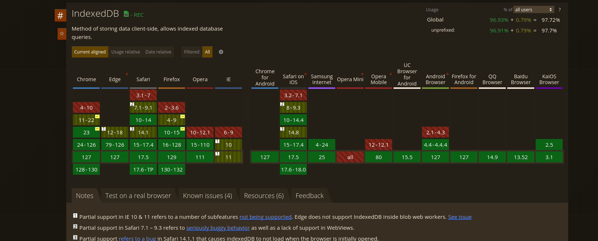

# Firas

-   Vitruve technical interview

-   **Note:** for creating custom pokemon i limited the image to 1mb, instead of having to look for an image, here is an example image you can use [Pokémon_Pikachu_art.png](https://upload.wikimedia.org/wikipedia/en/a/a6/Pok%C3%A9mon_Pikachu_art.png)

## Install dependencies

-   While inside the main dir (technical-test-vitruve) run `npm install` it will install the dependencies for both ui and api.

```bash
npm install
```

## Run both client and server concurrently

-   While inside the main dir (technical-test-vitruve)

```bash
npm run dev
```

-   This will run both the API and the UI at the same time

---

## Run the client on its own

```bash
cd ui && npm run dev
```

## Run the API on its own

```bash
cd api && npm run dev
```

## Tests :

-   I have made 4 tests

    -   Search bar test, to test if searching for a specefic pokemon works
    -   Pokemon widget test, to click the first pokemon and make sure that the widget is working.
    -   Sign up test, Tries to sign up for a new account.
    -   Login test, Tries to login into the account we just made.

-   Run `npm run test.e2e` inside the `ui` dir.

```bash
cd ui && npm run test.e2e
```

## Feedback

-   Extra features

    1. Incremental loading (loading the needed pokemon as they come into view), this makes the initial load much faster since you only need to load the pokemon that the user sees.
    2. Infinite scroll (which is a type of pagination, except we load next page automatically) no need to click a button that says "Next page"

    3. Filter pokemon through type.

-   App works offline (only thing that doesnt work are images) since we get them from githuhb's cdn, its possible to have the browser cache the cdn images with service workers but thats a bit overkill for this test.

-   Some things could be done more "efficient" for example the pokemon search function, if we cache the entire index on the client, but i choose to have the index on the server and search through http requests , because that is a more accurate presentation of a real world app (doesnt really make sense to store the entire search index on the client [load times would be horrible] )

-   For data persistance i choose to go with the indexed db, since the local storage only allows for 5MB (10MB if you use utf-16) and the indexed db doesnt have that limitation, Plus all modern browsers support the indexed db.

    -   

-   Authorization:
    -   In a real world sennario we would also have an expiary date for the access token, and when it expires we would force the user to login, but for this test that is not needed.
    -   We would Also use JWT probaby because that is becoming the standad
